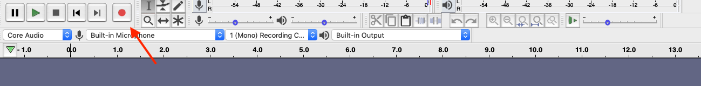

# Editing Audio

Editing is a creative and individual experience but there are a couple of strategies to make this process more efficient and streamlined.

*1*{: .circle .circle-blue} Create a rough first and then fine tune.

If you are editing a work with multiple tracks of audio (e.g. music, voiceover, sound effects, etc.), create a rough cut first by placing the sound in the approximate space that you want it to play. Once your tracks are in the right order, fine tune the audio by taking out the “ums”, adjusting volume, etc.

*2*{: .circle .circle-blue} Organize your sounds by using different tracks.

Organize your audio files by placing them on different tracks and labeling them (e.g. a track for music, a track for sound effects, a track for voiceover). Edit sound files in either AIPP or WAV file formats and export to MP3 later.

## Finding Sound Effects

If you want to add sound effects to your project, you can either create your own (e.g. using an app like GarageBand) or download ones that have already been created. Freesound (https://freesound.org/) is a great resource. It has a ton of free sound effects that are openly licensed. 

Freesound requires you to sign up for an account before downloading any sound effects.
{: .note}

## Finding Music

It is important that you have permission from the copyright holder to use any music that you include in your project especially if you plan to make your project available on the Internet. Free Music Archive (https://freemusicarchive.org/) is a resource that allows you to search for free music that is openly licensed. There is also Audio Jungle (https://audiojungle.net/) and ccMixter (http://ccmixter.org/view/media/picks).

Remember to check the copyright license and make sure to read the terms of that license. If you have any questions about copyright, contact the [UBC Copyright Office.](https://copyright.ubc.ca/)
{: .note}

# Editing with Audacity   

Audacity has many tools and effects to use but there are a few important ones to know before you begin your editing project. 

## Recording Audio in Audacity

To record audio in Audacity, select the appropriate microphone from the drop down menu. 

Plug in your microphone before you open Audacity otherwise it might not appear in the drop down menu.
{: .note}

To record sound, select the Record button. 

You can pause the recording. 

Or, stop the recording. 

## Adding Sound Files

To add a sound file to your Audacity project, select **File → Import Audio**.

## Cutting and Moving Audio

The Selection tool  allows you to highlight and select parts of an audio clip. This tool allows you to select a point where you would like to make a cut in the audio.

To cut the audio, select **Edit → Clip Boundaries → Split.**

The Time Shift Tool  allows you to move audio clips back and forth on the timeline, as well as move audio clips to other tracks.

## Adjusting Volume

The Envelope tool  allows you to adjust the volume of a particular part of the audio.

## Fade In/Fade Out

You may want to use the Fade In/Fade Out effect to make the transition from one sound to another more pleasant. Highlight the piece of audio that you want to fade using the Selection tool and then select **Effect → Fade In or Fade Out.**

## Exporting Audio

If you are creating something like a podcast, then you will probably want to export as an MP3 file.

To export, select **File → Export → Export as MP3**. Fill in as much information as you can in the metadata fields. This will be visible to podcast hosting platforms such as iTunes.

## Podcast Hosting

Once you’ve created your podcast, you’ll need to find a hosting platform so that your listeners can download your episodes. There are many different ones to choose from including Buzzsprout, Captivate or Libsyn. You might also choose to host your podcast on your website or blog if you have enough bandwidth.  

**Remember to include a transcript of your podcast with your episode so that it is as accessible as possible.**
