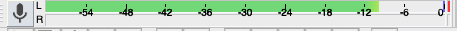
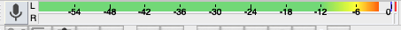

# Recording audio

No matter what type of recording equipment you are using, there are some similar strategies and best practices for ensuring you get the best sound quality as possible. When it comes to audio, it’s always better to try and record in the best environment possible than relying on fixing the sound errors in the editing room.

*1*{: .circle .circle-blue} Remember to keep a copy of the unedited audio.

If you’re recording in Audacity, save your unedited audio as an Audacity project or as a WAV file just in case. If you make too many edits or if something happens to your editing file, you’ll be glad that you have an unedited version to fall back on.

*2*{: .circle .circle-blue} Record in the quietest room possible.

Sometimes it’s not possible to record in a professional sound booth. When recording anywhere else, it’s important to minimize as much sound as possible. Try to avoid big, empty rooms where sound will create an echoing effect.

*3*{: .circle .circle-blue} Test your sound before you record.

When you’re in the space that you will be recording your audio, test it out. Record yourself speaking in the room and then play it back to yourself. How does it sound?

*4*{: .circle .circle-blue} Make sure your volume is the right level.

You want to play back the sound to make sure that your levels are not “too hot”. This means that the sound is not too loud. Audacity allows you to monitor your levels using the Mixer Toolbar. Ideally, you should be aiming for approximately -10 dB.

If your levels are too hot, it will go into the red and the sound will become distorted. If the sound is too loud during recording, it will be hard to fix when you are editing.  

*5*{: .circle .circle-blue} Speak towards the microphone, at the same distance, for the entire recording.

If you’re using an external microphone, make sure that you are facing the microphone and speaking at the same distance for the entire recording. If you stray too far from the microphone, you may end up getting different sound quality throughout your recording. Position your microphone slightly to the side of your mouth if you are not using a windscreen or pop filter.

*6*{: .circle .circle-blue} Record the room tone.

Every room has its own unique sound due to technology, windows, air conditioner, etc. Record some silent room tone in case you need it to fill in any gaps in the editing room.

# Editing Audio

Editing is a creative and individual experience but there are a couple of strategies to make this process more efficient and streamlined.

*1*{: .circle .circle-blue} Create a rough first and then fine tune.

If you are editing a work with multiple tracks of audio (e.g. music, voiceover, sound effects, etc.), create a rough cut first by placing the sound in the approximate space that you want it to play. Once your tracks are in the right order, fine tune the audio by taking out the “ums”, adjusting volume, etc.

*2*{: .circle .circle-blue} Organize your sounds by using different tracks.

Organize your audio files by placing them on different tracks and labeling them (e.g. a track for music, a track for sound effects, a track for voiceover). Edit sound files in either AIPP or WAV file formats and export to MP3 later.

## Finding Sound Effects and Music

If you want to add sound effects to your project, you can either create your own (e.g. using an app like GarageBand) or download ones that have already been created. Freesound (https://freesound.org/) is a great resource. It has a ton of free sound effects that are openly licensed. 

Freesound requires you to sign up for an account before downloading any sound effects.
{: .note}

#3 Finding Music

It is important that you have permission from the copyright holder to use any music that you include in your project especially if you plan to make your project available on the Internet. Free Music Archive (https://freemusicarchive.org/) is a resource that allows you to search for free music that is openly licensed. There is also Audio Jungle (https://audiojungle.net/) and ccMixter (http://ccmixter.org/view/media/picks).

Remember to check the copyright license and make sure to read the terms of that license. If you have any questions about copyright, contact the [UBC Copyright Office.](https://copyright.ubc.ca/)
{: .note}
